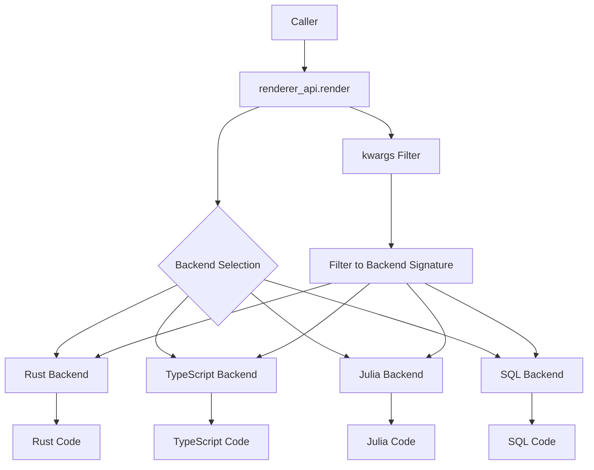

# Why the Central Renderer API?

## 🎯 **The Problem**

Before the central renderer API, each backend had slightly different function signatures:

```python
# Different signatures across backends
render_rust(ir, parallel=True, int_type="i32")
render_ts(ir, parallel=True)  # No int_type
render_julia(ir, parallel=True, mode="broadcast", unsafe=True)  # Extra params
render_sql(ir, dialect="postgresql")  # Completely different params
```

This led to:
- **Signature Drift**: Adding new backend flags broke existing code
- **Type Errors**: `TypeError: unexpected keyword argument`
- **Maintenance Nightmare**: Every backend change required updating all callers
- **Test Failures**: Golden tests broke when backends evolved

## 🚀 **The Solution: Central Renderer API**

The central renderer API eliminates these problems with automatic kwargs filtering:

```python
from pcs.renderer_api import render

# Single interface for all backends
rust_code = render("rust", ir, parallel=True, int_type="i32", mode="broadcast", unsafe=True)
ts_code = render("ts", ir, parallel=True, int_type="i32", mode="broadcast", unsafe=True)
julia_code = render("julia", ir, parallel=True, int_type="i32", mode="broadcast", unsafe=True)
sql_code = render("sql", ir, parallel=True, int_type="i32", mode="broadcast", unsafe=True)
```

## 🏗️ **How It Works**



### **Step-by-Step Process:**

1. **Caller** passes over-full kwargs to `renderer_api.render()`
2. **Adapter** inspects the target backend's function signature
3. **Filter** removes kwargs that the backend doesn't accept
4. **Backend** receives only the kwargs it expects
5. **Result** is generated without signature errors

## ✅ **Benefits**

### **🔒 Zero Signature Drift**
```python
# This works even if backends change their signatures
render("rust", ir, parallel=True, mode="broadcast", unsafe=True, dialect="postgresql")
# ↑ Only parallel=True reaches the Rust backend, others are filtered out
```

### **🚀 Future-Proof**
```python
# Adding new backend flags won't break existing code
render("rust", ir, new_flag=True, another_flag=False)
# ↑ New flags are safely ignored by backends that don't support them
```

### **🧪 Test Stability**
```python
# Tests work regardless of backend signature changes
def test_all_backends():
    for backend in ["rust", "ts", "go", "csharp", "julia", "sql"]:
        output = render(backend, ir, parallel=True, mode="broadcast", unsafe=True)
        assert len(output) > 0
```

### **🔧 Developer Experience**
```python
# Single import for all backends
from pcs.renderer_api import render

# No need to remember different function signatures
# No need to handle different parameter sets
# No need to worry about signature changes
```

## 📊 **Before vs After**

| Aspect | Before (Direct Imports) | After (Central API) |
|--------|------------------------|-------------------|
| **Signature Errors** | ❌ Common | ✅ Eliminated |
| **Backend Changes** | ❌ Break callers | ✅ Safe |
| **Test Maintenance** | ❌ High | ✅ Low |
| **Developer Experience** | ❌ Complex | ✅ Simple |
| **Future-Proofing** | ❌ Fragile | ✅ Robust |

## 🎯 **Real-World Example**

### **Before (Fragile)**
```python
# This breaks when backends change signatures
from pcs.renderers.rust import render_rust
from pcs.renderers.ts import render_ts

# Different signatures = maintenance nightmare
rust_code = render_rust(ir, parallel=True, int_type="i32")
ts_code = render_ts(ir, parallel=True)  # No int_type support
```

### **After (Robust)**
```python
# This works regardless of backend signature changes
from pcs.renderer_api import render

# Same interface for all backends
rust_code = render("rust", ir, parallel=True, int_type="i32")
ts_code = render("ts", ir, parallel=True, int_type="i32")  # int_type safely ignored
```

## 🚀 **Migration Path**

### **Step 1: Update Imports**
```python
# Old
from pcs.renderers.rust import render_rust
from pcs.renderers.ts import render_ts

# New
from pcs.renderer_api import render
```

### **Step 2: Update Calls**
```python
# Old
rust_code = render_rust(ir, parallel=True, int_type="i32")
ts_code = render_ts(ir, parallel=True)

# New
rust_code = render("rust", ir, parallel=True, int_type="i32")
ts_code = render("ts", ir, parallel=True, int_type="i32")
```

### **Step 3: Enjoy Benefits**
- ✅ No more signature errors
- ✅ Future-proof code
- ✅ Simplified maintenance
- ✅ Better developer experience

## 🎉 **Conclusion**

The central renderer API transforms the Polyglot Code Sampler from a fragile, signature-drift-prone system into a robust, future-proof platform that can evolve without breaking existing code.

**Key Takeaway**: One adapter eliminates signature drift permanently, making the entire codebase resilient to backend changes while providing a consistent, developer-friendly interface.
